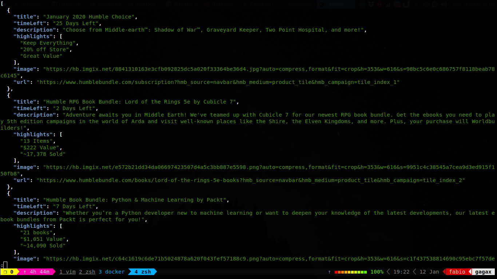

# Humble Bundle (unofficial) API
### Just an unofficial API for Humble Bundle

## Why?
For 2 main reasons actually.  First, and probably the most important one, this is the backend of the [Humble Bundle Updater channel](https://t.me/humblebundleupdater) on Telegram. The second reason it was because I wanted to study microservices, so I've split the logic behind the channel into modules, and this is probably the most important one.

## Build instructions
The easiest way to run this project is by using docker. Once you have docker installed in your machine you can just follow the next steps.

```
$ git clone git@github.com:Ziggoto/Humble-Bundle-Api.git
$ docker build -t humble-bundle-api .
$ docker run -p 3000:3000 humble-bundle-api
```
Than access your browser on `http://localhost:3000/get-bundles`

### Demo



### License

```
        DO WHAT THE FUCK YOU WANT TO PUBLIC LICENSE
                    Version 2, December 2004

 Copyright (C) 2004 Sam Hocevar <sam@hocevar.net>

 Everyone is permitted to copy and distribute verbatim or modified
 copies of this license document, and changing it is allowed as long
 as the name is changed.

            DO WHAT THE FUCK YOU WANT TO PUBLIC LICENSE
   TERMS AND CONDITIONS FOR COPYING, DISTRIBUTION AND MODIFICATION

  0. You just DO WHAT THE FUCK YOU WANT TO.
```

